# Administrative Boundaries Manager

Load, manage and visualize administrative boundaries for a country or more, in Wagtail Projects.

# Overview

The Admin Boundary Manager is a Wagtail based application that enables to load boundary datasets from different sources,
at different administrative levels as provided by the source, for a country. The boundaries can then be served as vector
tiles and used in web maps, and across your GIS based application that needs reference to a country and its boundaries.

`A country` is at the core of the package. This means that you will load boundary data country by country. You can have
multiple countries. This is a design decision specifically for this package. If you need to load, say continental data
at once, this might not be the best solution for your case.

### Features

- Load administrative boundaries from different sources. Supported sources include:
    - OCHA's Administrative Boundary Common Operational Datasets (COD-AB)
    - Global Administrative Areas 4.1 (GADM 4.1)
    - Load data from other sources. At the core, we define a boundary model schema that you can follow to load data from
      other sources not currently implemented out of the box
- Preview loaded boundary data to check that everything is correct as expected
- Serve boundary data as vector tiles for use in your web maps. Data is saved to a PostGIS Table.`ST_AsMVT` is used to
  serve vector tiles

# Installation

### Prerequisites

You need a Wagtail Project, with a PostGIS database setup, to support a GeoDjango project.

### Installation

You can install the package using pip:

```shell
pip install adm-boundary-manager
```

# Usage

Make sure the following are all added to your `INSTALLED_APPS` in your Wagtail settings

```python
INSTALLED_APPS = [
    "adminboundarymanager",
    "django_countries",
    "wagtailcache",

    "wagtail.contrib.modeladmin",
    "wagtail.contrib.settings",

    "django.contrib.gis",
]
```

Run app migrations

```shell
python manage.py migrate adminboundarymanager
```

Add the following to your project's `urls.py`

```python
urlpatterns = [
    ...
    path("", include("adminboundarymanager.urls")),
    ...
]
```

### Wagtail Cache Setup

The package uses the [wagtail-cache](https://github.com/coderedcorp/wagtail-cache) package for caching vector tile
requests. Please have a look at the [wagtail-cache documentation](https://docs.coderedcorp.com/wagtail-cache/) for setup
instructions.

## Accessing the settings and data loader interface

The `Admin Boundary settings` will be added to the `Wagtail Settings` panel automatically. To access the `Boundary Data`
loader and preview interfaces, you can follow the following steps:

In an existing or new Wagtail app, add the following to the `wagtail_hooks.py` file. Create one if it does not exist
yet.

```python
from wagtail.contrib.modeladmin.options import modeladmin_register

from adminboundarymanager.wagtail_hooks import AdminBoundaryManagerAdminGroup

modeladmin_register(AdminBoundaryManagerAdminGroup)
```

This will add a `Boundary Manager` menu to the Wagtail Admin side panel, as in the below screenshot:

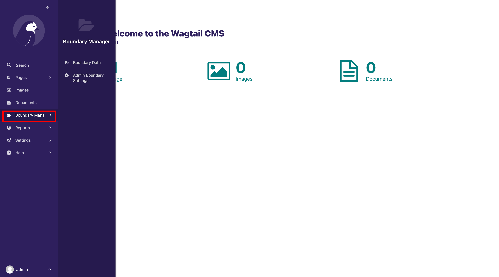

Click to expand and access the submenu

## Boundary Settings

The `Boundary Settings` allow to configure settings used by the package. This
uses [Wagtail's Site Settings](https://docs.wagtail.org/en/latest/reference/contrib/settings.html) contrib module.

The following are the available settings, as shown in the screenshot below:

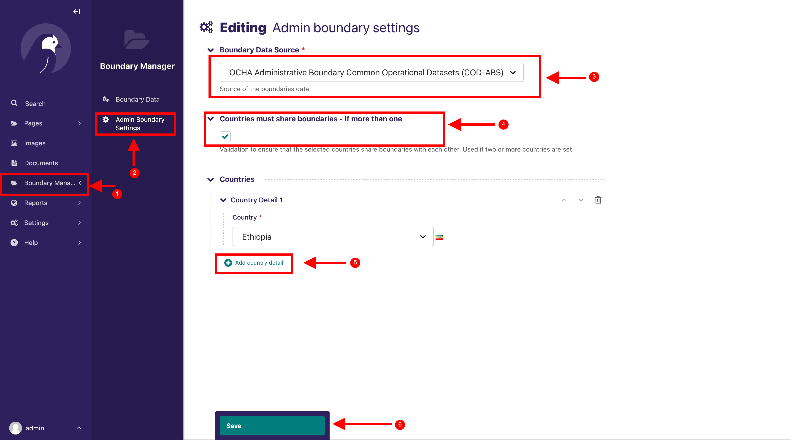

1. Access the `Boundary Manager` menu, as described in the previous section
2. Click on `Admin Boundary Settings`
3. `Boundary Data Source` - Select where you will be getting your boundary data from. See following sections for more
   details on the database model and supported data sources
4. `Countries must share boundaries` - Check this if you plan to add boundaries for more than one country, and want to
   validate that all the added countries `share a boundary at least with one other country`.
5. `Countries` - Here you can add multiple countries that you wish to load data for.
6. Save button

# Boundary Model Structure

The `AdminBoundary` model is a simple [Geodjango](https://docs.djangoproject.com/en/4.2/ref/contrib/gis/model-api/)
model with the following fields

- name_0
- name_1
- name_2
- name_3
- name_4
- gid_0
- gid_1
- gid_2
- gid_3
- gid_4
- level
- geom

As you might have noticed, the model supports up to 4 administrative levels. The `level` field indicates the specific
level for a given model instance.

The fields starting with prefix `name_` correspond to the `name` of the admin boundary at a given level. For
example `name_0`
corresponds to the name of the boundary at admin level 0, which is usually the country level.

The fields starting with prefix `gid_` correspond to the `ID` of the admin boundary at a given level. For
example `gid_0` corresponds to the id of the boundary at admin level 0, which is usually the country code in
either [alpha2](https://en.wikipedia.org/wiki/ISO_3166-1_alpha-2) (2-letter code)
or [alpha3](https://en.wikipedia.org/wiki/ISO_3166-1_alpha-3) (3-letter code) format.

The `geom` field is a `Geodjango` field that stores the boundary geometry as a `Multipolygon`. Every boundary instance
is saved as a Multipolygon, even if it was initially a Polygon. This is to ensure consistency across the Model.

Using this schema, you can format any boundary data to follow this structure and easily load it.

The [LayerMapping](https://docs.djangoproject.com/en/4.2/ref/contrib/gis/layermapping/) utility is used under the hood
to load the boundaries from a GIS formatted file, that can be a shapefile or Geopackage, depending on the source.

# Supported Data Sources

Currently, the following data sources are supported out of the box:

- [OCHA's Administrative Boundary Common Operational Datasets (COD-AB)](https://humanitarian.atlassian.net/wiki/spaces/codtsp/pages/41973316/Administrative+Boundary+CODs+COD-AB)
- [Global Administrative Areas 4.1 (GADM 4.1)](https://gadm.org/)

## OCHA COD AB - Accessing, downloading and loading OCHA's COD-CAB data

[Administrative Boundary CODs](https://humanitarian.atlassian.net/wiki/spaces/codtsp/pages/41973316/Administrative+Boundary+CODs+COD-AB)
are baseline geographical datasets that are used by humanitarian agencies during preparedness and response activities.

They are preferably sourced from official government boundaries but when these are unavailable the IM network must
develop and agree to a process to develop an alternate dataset.

Where available, we `recommend` using this data source since most of the data is sourced from official Government
sources. The boundary source covers most of African Countries.

### Download and organize COD-AB data

Below are steps to download and load the boundary data for a country of interest:

- First you will need to acces¬s the
  OCHA's [Humanitarian Data Exchange](https://data.humdata.org/dashboards/cod?cod_level=cod-standard&cod_level=cod-enhanced&dataseries_name=COD%20-%20Subnational%20Administrative%20Boundaries&q=&sort=if(gt(last_modified%2Creview_date)%2Clast_modified%2Creview_date)%20desc)
  Platform.
  This [link](https://data.humdata.org/dashboards/cod?cod_level=cod-standard&cod_level=cod-enhanced&dataseries_name=COD%20-%20Subnational%20Administrative%20Boundaries&q=&sort=if(gt(last_modified%2Creview_date)%2Clast_modified%2Creview_date)%20desc)
  will take you directly to the COD-AB data download page, similar to the below screenshot:

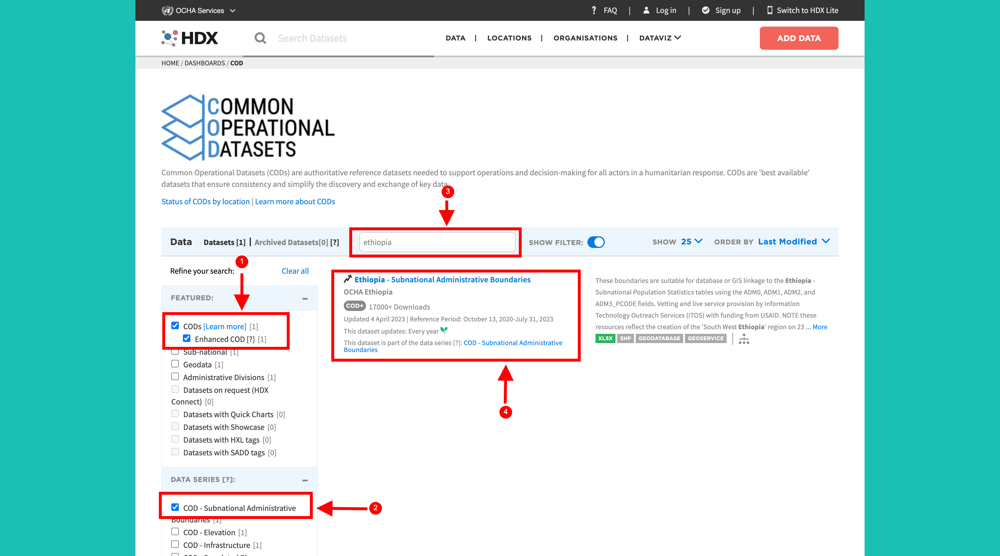

1. Make sure `CODS` is checked on the filter panel, under `Featured` section
2. Still on the filter panel, under the `Data Series` section, make sure `COD - Subnational Administrative Boundaries`
   is checked
3. You can search for your country of interest here
4. The results will be shown here. Click on the country result to go to the download page, that will look similar to the
   screenshot below:

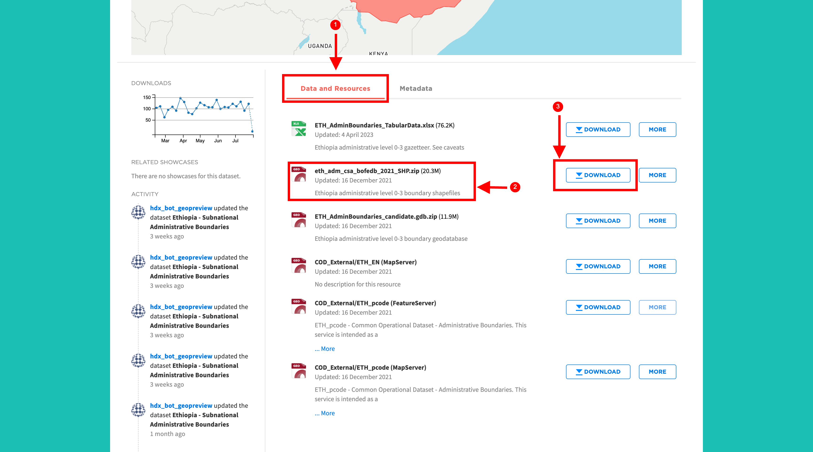

Once in the dataset detail page, follow the steps below to download the country boundaries `shapefiles`

1. Select the `Data and Resources` tab if not selected by default
2. Look for the `shapefile` dataset. The file name will usually end with `SHP.zip`. This is the correct file that you
   should download
3. Once you identify the shapefile, click on the `DOWNLOAD` button to download the shapefile

Once downloaded, extract the shapefile to an accessible location in your computer. Once extracted, you will notice a
large number of files. That is ok.

The files are for all the administrative levels, usually from 0 to 3, and also all levels combined. We want the data at
different levels. We will need to `group and zip the files for the same levels`, as in the sample screenshot below:

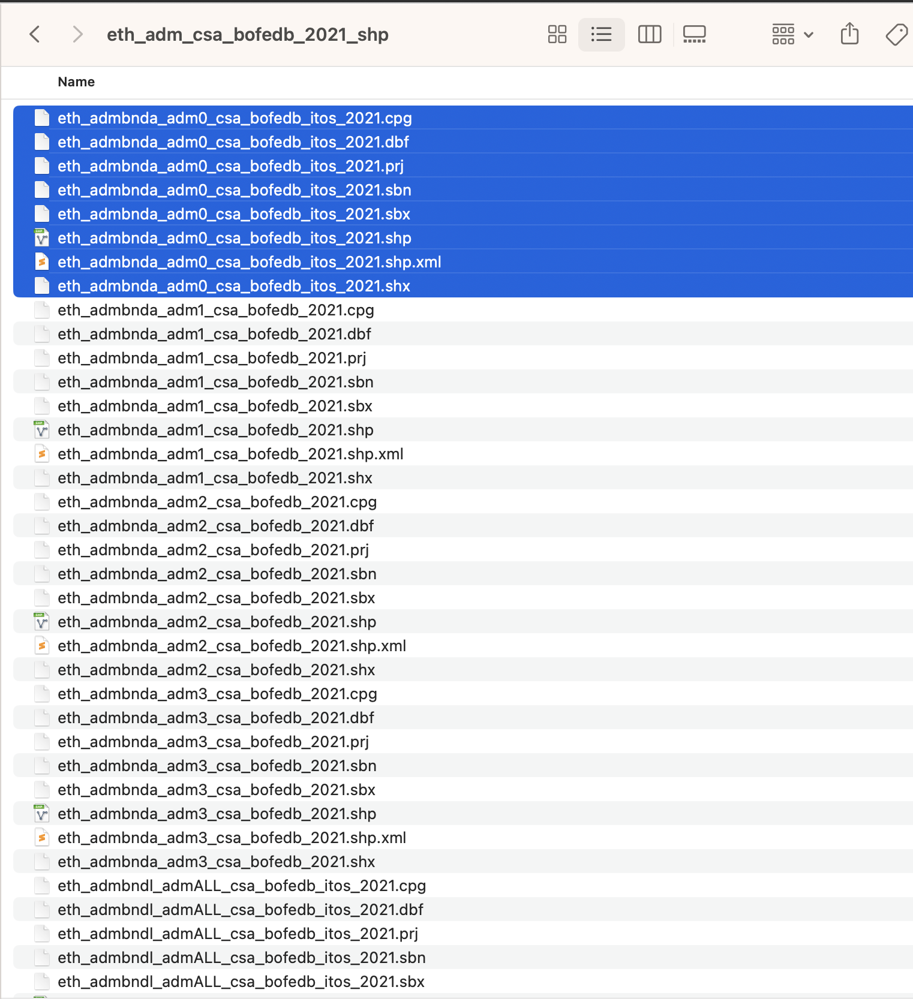

Group similar admin level files and zip them. Look out for patterns, for example for admin level 0 files, they will
contain the characters `adm0` or similar somewhere in the middle of the name.

Make sure for each level you have at-least 3 files with the following extensions:

- `.shp`
- `.shx`
- `.dbf`

These are the necessary files for a valid shapefile. You should end up with zip files for at least 3 levels.

You can name the admin level zip files with an easy name that you can identify later. For example for level one, you can
have `<country_name>_level_0.zip`

### Loading COD-AB Data

Before accessing the data loading interface, make sure you have
selected ` OCHA Administrative Boundary Common Operational Datasets (COD-ABS)` as the `Boundary data source` option in
the `Admin Boundary Settings`

Also make sure you add the countries of interest under the `Countries` section in the `Admin Boundary Settings`

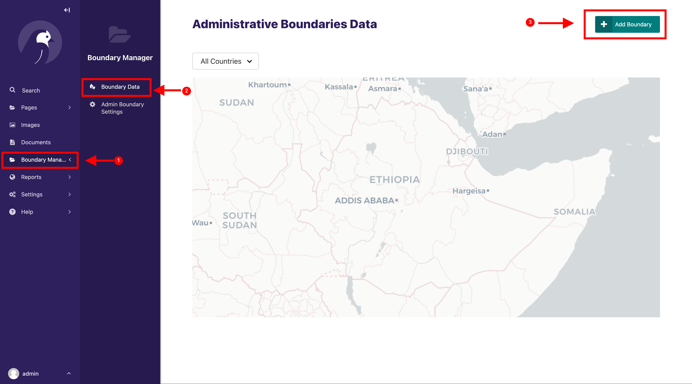

1. Click on the Boundary Manager
2. Click on Boundary Data. This will open the boundary preview interface, with a `Add Boundary` button in the top right
   corner
3. Click on the `Add Boundary` button, to open an interface that looks like in the below screenshot

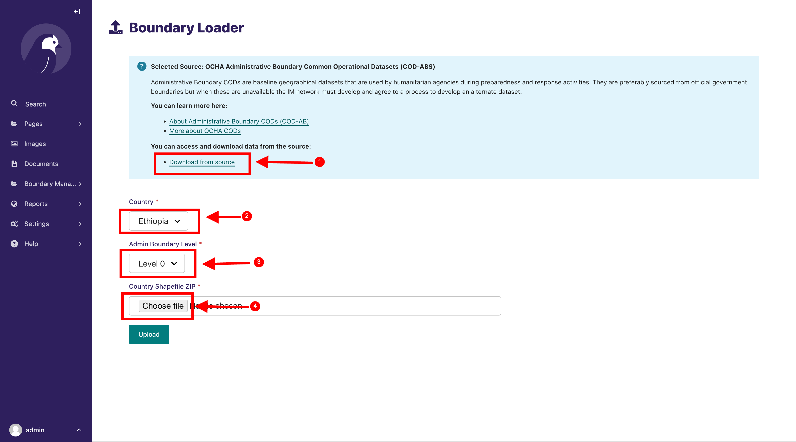

1. This is the link to the data source, as described in the previous section
2. Select the country you want to load the data for. Make sure you select the country corresponding to the country data
   you want to upload. To add a new country, you can do so from the `Admin Boundary Settings`
3. Select the `Administrative level` for the country boundary data you want to upload
4. Select the zipped shapefile for the country boundary level data. Make sure you select the correct zipped file for the
   correct country and level. The file must be a `zipped shapefile` as described the previous section.

If done correctly, you will be redirected to the preview page, and see the data loaded on the map.

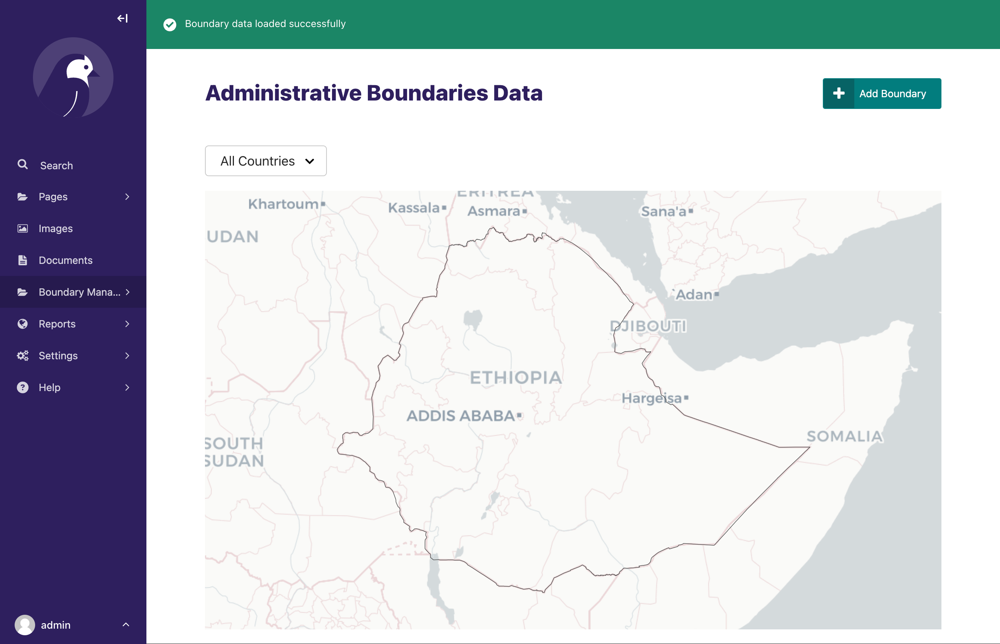

If an error was encountered during the upload process, an error message will show up with details of the error.

Repeat the process for all the administrative levels datasets that you want to load.

`NOTE:` If you load data for an already existing level and country, the existing boundary data for that level and
country will be deleted and the new one saved.

## GADM 4.1 - Accessing, downloading and loading GADM 4.1 Data

The [Global Administrative Areas 4.1 (GADM)](https://gadm.org/")  is a database of the location of the world's
administrative areas (boundaries) Administrative areas in this database include: countries, counties, districts etc. and
cover every country in the world. For each area it provides some attributes foremost being the name and in some cases
variant names.

The most recent version is `4.1` and this is the version currently supported by this package.

### Download GADM 4.1 data

Access the [GADM data ](https://gadm.org/data.html) page. It should look similar to below screenshot:

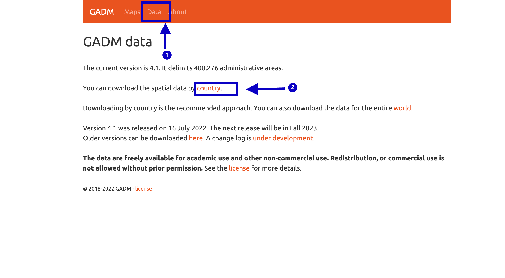

1. Click on the `Data` link from the navigation bar. The data page, at the time of writing, looks like the above
   screenshot.
2. Click on the `country` link that will take you to a download interface for specific countries. Remember we have to do
   it country by country in our upload interface.

The `Country` download interface will look like below:

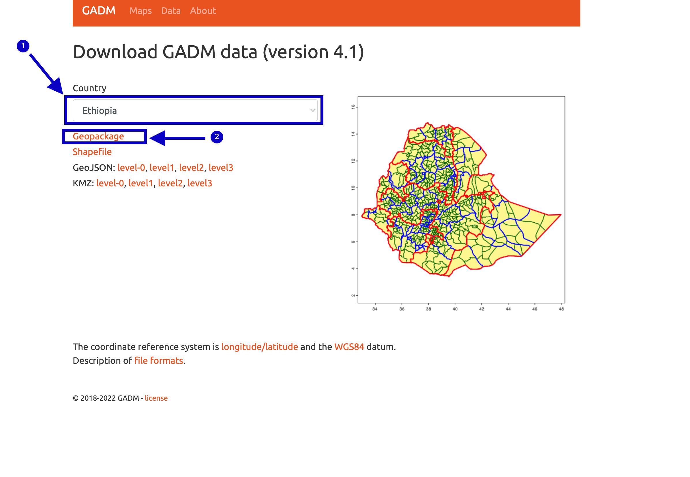

1. Select your country of interest. GADM data should available for all countries in the world.
2. Look for the `Geopackage` download link. For GADM data, downloading a geopackage comes with all the data for all the
   different levels

Once you download the country geopackage and save it somewhere in your computer, you are ready to load it.

### Load GADM 4.1 data

Before accessing the data loading interface, make sure you have selected `Global Administrative Areas 4.1 (GADM)` as
the `Boundary data source` option in the `Admin Boundary Settings`

Go to `Boundary Data` > `Add Boundary`. The upload form should look like below

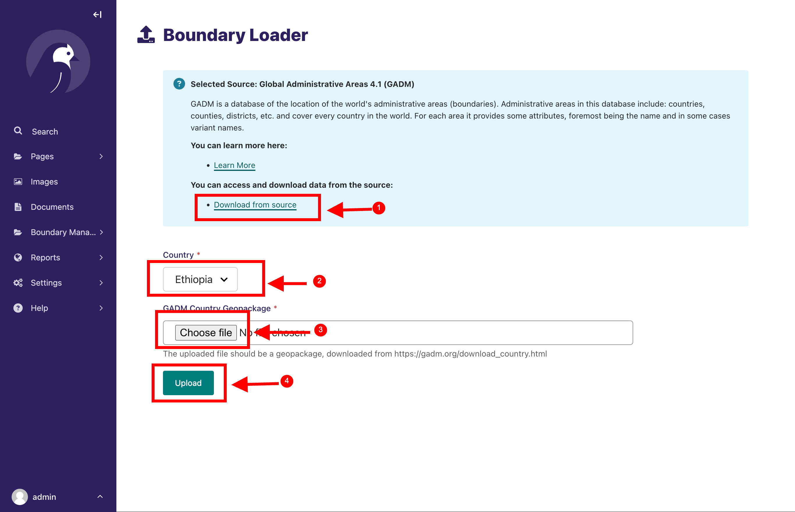

1. Link to download data for country, as explained in previous section
2. Select the country for the data you downloaded. To add a new country, you can do so from
   the `Admin Boundary Settings`
3. Choose the geopackage file for the country data you downloaded
4. Click on upload

If done correctly, you will be redirected to the preview page, and see the data loaded on the map.

If an error was encountered during the upload process, an error message will show up with details of the error.

Repeat the process for all the countries' data that you want to load.

`NOTE:` If you load data for an already existing country, the existing boundary data for that country will be deleted
and the new one saved.

## Boundary data from other sources

As explained in the [Boundary Model Structure](#boundary-model-structure) section, by following the defined model
structure, you can add data from other sources.

You will need to separate your country boundary dataset into the different levels. That means for example, form level 0
of a country, you will a `zipped shapefile`, as so on for all the levels you want to upload.

Your shapefile data should contain the following fields for each level.

#### Level 0

- name_0
- gid_0

#### Level 1

- name_0
- gid_0
- name_1
- gid_1

#### Level 2

- name_0
- gid_0
- name_1
- gid_1
- name_2
- gid_2

#### Level 3

- name_0
- gid_0
- name_1
- gid_1
- name_2
- gid_2
- name_3
- gid_3

`NOTE`: The field names are case-insensitive. They can be in lowercase or uppercase.

### Loading data from other sources

Before accessing the data loading interface, make sure you have selected `Generic Data Source` as
the `Boundary data source` option in the `Admin Boundary Settings`

Go to `Boundary Data` > `Add Boundary`. The upload form should look like below

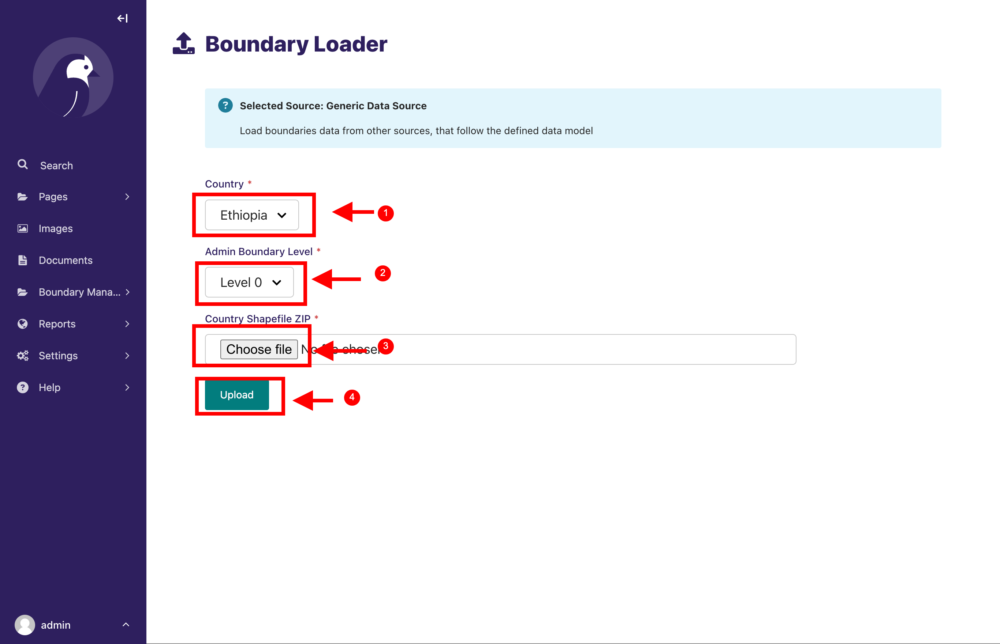

1. Select the country to upload data for
2. Select the admin level
3. Choose your `zipped shapefile` for the selected admin level
4. Click on `Upload` to load

If done correctly, you will be redirected to the preview page, and see the data loaded on the map.

If an error was encountered during the upload process, an error message will show up with details of the error.

Repeat the process for all the administrative levels datasets that you want to load for a country.

# Important notes

- For consistency, you should decide on one data source and use it for all your countries
- Re-uploading data for a given country and or level, will delete any existing data for that country and or level, and
  replace with the new uploaded one
- Deleting a country from the settings will delete any previously loaded data for that country

# Cache Invalidation

Wagtail Cache is invalidated automatically at the following points:

- On Updating `AdminBoundarySettings`
- On uploading or overwriting boundary data

# Data API

API endpoints are provided for searching, retrieving and serving vector tiles for the boundary data.

### Search endpoint

`/api/admin-boundary/search?search=<name>`

The search endpoint allows searching Admin Boundaries by `name_0`, `name_1`, `name_2` and `name_3`. This will give you
results for all boundaries whose name match the search phrase.

### Retrieve endpoint

`/api/admin-boundary/<boundary_id>`

The retrieve endpoint allows to get an admin boundary by ID. This assumes you already know the ID for the boundary
instance you wish to retrieve.

Usually you will use this endpoint in conjunction with the search API.

A use case will be to use the `Search Endpoint` to search for a given admin level by name in an autocomplete select
input, show the matching results in the result dropdown. Once the user selects a result item, you can use the
the `Retrieve endpoint` to retrieve the detail of the boundary, using the ID of the selected boundary item.

### Vector Tiles Endpoint

`/api/admin-boundary/tiles/<int:z>/<int:x>/<int:y>`

The vector tiles endpoint can be used to serve the vector tiles from the boundary data. Usually, you will use this with
a web mapping library that supports vector tiles, like [MapLibre GL JS](https://maplibre.org/maplibre-gl-js/docs/)

Below is a quick snippet on how you can add boundary vector tile layers to your MapLibre web map:

```html

<head>
    <link rel="stylesheet" href="https://unpkg.com/maplibre-gl/dist/maplibre-gl.css">
</head>

<body>
<div id="map"></div>


<script src="https://unpkg.com/maplibre-gl/dist/maplibre-gl.js"></script>
<script>
    const map = new maplibregl.Map({
        container: 'map', // container id
        style: 'https://demotiles.maplibre.org/style.json', // style URL
        center: [0, 0], // starting position [lng, lat]
        zoom: 1 // starting zoom
    });


    const boundaryTilesUrl = "/api/admin-boundary/tiles/<int:z>/<int:x>/<int:y>`"

    map.on("load", () => {

        // add source
        map.addSource("admin-boundary-source", {
                    type: "vector",
                    tiles: [boundaryTilesUrl],
                }
        )

        // add fill layer
        map.addLayer({
            'id': 'admin-boundary-fill',
            'type': 'fill',
            'source': 'admin-boundary-source',
            "source-layer": "default",
            'paint': {
                'fill-color': "#fff",
                'fill-opacity': 0,
            }
        });

        // add line layer
        map.addLayer({
            'id': 'admin-boundary-line',
            'type': 'line',
            'source': 'admin-boundary-source',
            "source-layer": "default",
            'paint': {
                "line-color": "#444444",
                "line-width": 0.7,
            }
        });
    })


</script>

</body>
```

`Note`: The vector tile `source-layer` is named as `default`

All the fields are available in the vector tile data. This means you can show, on a popup for example, the data for a
boundary on click.

You can also use this to filter which data is shown on the map.

For example if you only wanted to show data for admin level 0, (i.e Country Level), you can do it as in the example
below:

```js
const boundaryFilter = ["==", "level", 0]

// add fill layer, with custom filter
map.addLayer({
    'id': 'admin-boundary-fill',
    'type': 'fill',
    'source': 'admin-boundary-source',
    "source-layer": "default",
    'paint': {
        'fill-color': "#fff",
        'fill-opacity': 0,
    },
    "filter": boundaryFilter
});

```